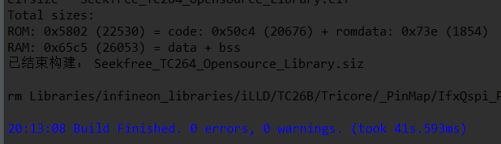
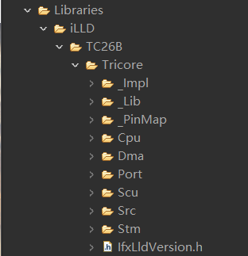
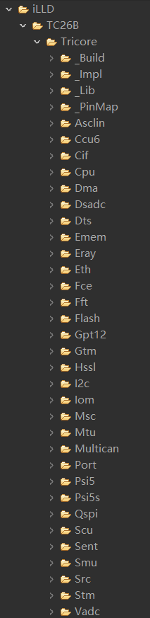
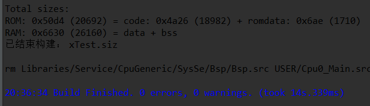
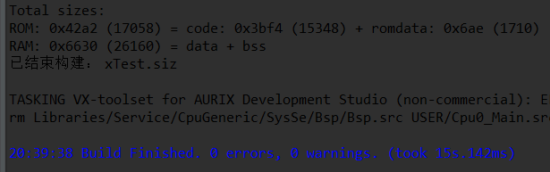
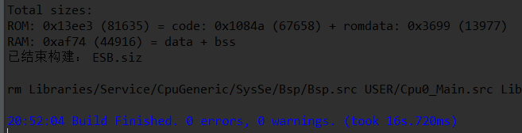

[逐飞科技TC264开源库](https://gitee.com/seekfree/TC264_Library)包含的东西太多，直接把所有头文件都放在一个header.h文件里编译起来也比较慢，逐飞TC264的模板我编译用了40多秒

再加上我自己写的其他文件差不多需要45秒，我想着怎么能够让他编译的更加快呢，一开始把逐飞库里一些不用的文件删了，结果速度还是太慢。iLLD的内容有太多，改起来太慢，只能放弃了。

然后偶然有一天我发现用ADS新建工程可以有两种选择

一种简化版的应该只有TC264的基础部分

另一种就是包含了各种库（spi, usart, iic等）的完全版本

于是我就建了一个简化版的工程，开始对逐飞的库进行移植，而简化版就仅仅包含一些核心文件，只能够使工程构建成功，单片机启动，其他的文件一个都没有，然后我又建了一个full版的工程，将逐飞的库文件一个个加进工程里，编译时缺少的文件从full版里面复制。删除了逐飞的包含了所有头文件的header.h文件及其所有外设文件及其文件夹。其他东西删删改改，最后编译成功，仅仅用了14秒左右

然后我为了确定程序正确性，又以Release模式编译工程（Release 模式下编译默认开启2级优化，对程序的要求更加严格)

无错误无警告，确定了我的这个方法是可行的。
然后我又将以前写的工程移植到了这个新的模板工程下
每次编译也仅仅只用16秒左右。

我每次修改程序在编译前都要clear工程，如果不clear就编译，虽然编译很快差不多1s多2秒，但是编译生成的文件，下载进单片机很有可能还是以前的，修改宏之后定义不clear就下载进单片机，可能性最大。

大家也可以按照我的这种方法去加快编译时间，如果是TC264的工程的话也可以下载我已经写好的TC264的模板使用。
